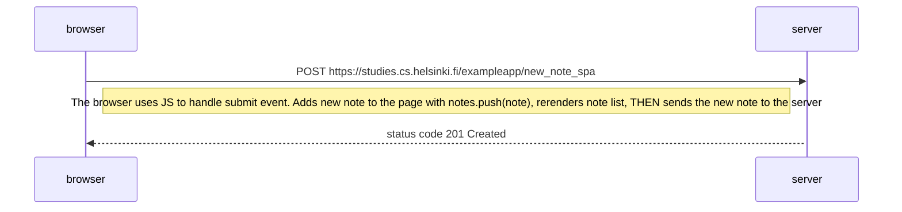

```mermaid
sequenceDiagram
    participant browser
    participant server

    browser->>server: POST https://studies.cs.helsinki.fi/exampleapp/new_note_spa
    activate server
    Note right of browser: The browser uses JS to handle submit event. Adds new note to the page with notes.push(note), rerenders note list, THEN sends the new note to the server
    server-->>browser: status code 201 Created

```
